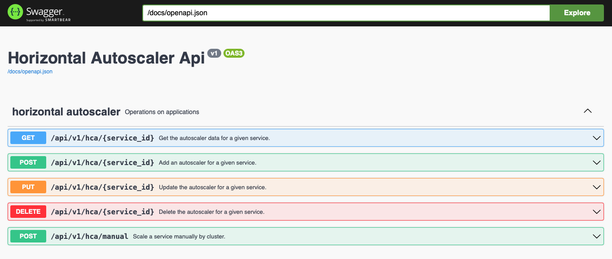

# Root Orchestrator - Horizontal Autoscaler

## Overview

The `root_orchestrator/horizontal-autoscaler` is a centralized service responsible for managing and coordinating multiple cluster-level horizontal auto-scalers. It ensures efficient scaling across multiple Kubernetes clusters, optimizes resource utilization, and maintains application availability by dynamically adjusting service replicas based on workload metrics.

As cloud-native applications grow in complexity, managing scaling across multiple clusters becomes a challenge. The root orchestrator serves as the control center for horizontal scaling decisions, ensuring optimal workload distribution, auto-recovery mechanisms, and persistent storage of scaling configurations in MongoDB.

This document provides an in-depth understanding of the root orchestrator’s functionality, setup, API usage, monitoring mechanisms, and best practices.

---

## Features

### 🔹 Multi-cluster Scaling Management
- Centralized control over multiple clusters.
- Ensures balanced resource allocation across all available clusters.

### 🔹 Auto-Recovery Mechanism
- Automatically restarts previously active auto-scalers on startup.
- Recovers last known configurations from MongoDB.

### 🔹 Persistent Storage with MongoDB
- Stores scaling configurations persistently.
- Ensures continuity and state recovery after unexpected restarts.

### 🔹 Threshold-based Auto-Scaling
- Dynamically adjusts service replicas based on CPU, memory, and custom-defined metrics.

---

## Architecture

The root orchestrator interacts with multiple `cluster_orchestrator/horizontal-autoscaler` instances and plays a crucial role in monitoring, decision-making, and execution.

### **Key Responsibilities:**
1. **Stores Configurations in MongoDB:** Saves all scaling parameters to ensure persistence.
2. **Monitors Cluster States:** Ensures no single cluster is overwhelmed.
3. **Triggers Cluster-wide Scaling Actions:** Decides when and where to scale services.
4. **Reinstates Auto-Scalers:** Restores monitoring processes upon restart.

### **System Components:**

#### 📌 **MongoDB Storage Layer**
- Acts as a persistent storage backend for all scaling configurations.
- Ensures service states can be recovered after restarts.

#### 📌 **Cluster Communicator**
- Interfaces with individual Kubernetes clusters.
- Issues scaling commands and fetches real-time cluster status.

#### 📌 **Auto-Recovery Mechanism**
- Retrieves previously active auto-scalers from MongoDB.
- Restarts monitoring processes to maintain seamless operations.

---

## Installation

### **Prerequisites**
- An up and running Oakestra cluster.
- Python 3.8+ installed on the orchestrator node.
- A running MongoDB instance.

### **Deployment Steps**

#### 1️⃣ Clone the Repository
```sh
$ git clone https://github.com/ECTLab/oakestra-hca.git
$ cd root_orchestrator/horizontal-autoscaler
```

#### 2️⃣ Install Dependencies
```sh
$ pip install -r requirements.txt
```

#### 3️⃣ Configure Environment Variables
```sh
export SYSTEM_MANAGER_URL=localhost
export SYSTEM_MANAGER_PORT=10000
export MY_PORT=10080
export CHECK_INTERVAL=10
export CLUSTER_MANAGER_URL=localhost
export CLUSTER_MANAGER_PORT=10180
export MONGO_ROOT_URI=mongodb://localhost:10007/
export DATABASE_ROOT_HCA=horizontal_autoscaler
export COLLECTION_ROOT_HCA=service_cluster_mapping
```

#### 4️⃣ Start the Auto-Scaler
```sh
$ python3 horizontal_autoscaler.py
```

---

## Usage

### **API Documentation**
To explore API endpoints, navigate to:
```sh
localhost:10080/api/docs
```



### **Get Service Data for Scaling**
```sh
curl -X GET http://localhost:10080/api/v1/hca/<service_id>
```

### **Start Monitoring a Service**
```sh
curl -X POST http://localhost:10080/api/v1/hca/<service_id> --data '{
    "cpu_threshold": 1,
    "ram_threshold": 40,
    "max_replicas": 4,
    "min_replicas": 1
}'
```

### **Update Service Scaling Parameters**
```sh
curl -X PUT http://localhost:10080/api/v1/hca/<service_id> --data '{
    "cpu_threshold": 1,
    "ram_threshold": 40,
    "max_replicas": 8,
    "min_replicas": 1
}'
```

### **Stop Monitoring a Service**
```sh
curl -X DELETE http://localhost:10080/api/v1/hca/<service_id>
```

### **Manual Scaling (For AI Models & Special Cases)**
```sh
curl -X POST http://localhost:10080/api/v1/hca/manual --data '{
    "scale_type": "down",  // Options: "up" or "down"
    "service_id": "67e142b1adbe153707b38bb8",
    "cluster_id": "67dda17adea7a1ce9586ad94"
}'
```

---

## Auto-Recovery Mechanism

### **How It Works**
1. **Startup Check:** When the orchestrator starts, it queries MongoDB for previously active auto-scalers.
2. **Configuration Retrieval:** It retrieves the last known scaling configurations.
3. **Service Reinstatement:** It automatically restarts monitoring services for all registered applications.

---

## API Endpoints

| Method | Endpoint | Description |
|--------|-------------|-------------|
| GET | `/api/v1/hca/<service_id>` | Fetch service scaling data |
| POST | `/api/v1/hca/<service_id>` | Start monitoring a service |
| PUT | `/api/v1/hca/<service_id>` | Update monitoring configuration |
| DELETE | `/api/v1/hca/<service_id>` | Stop monitoring a service |
| POST | `/api/v1/hca/manual` | Manual scaling of service |

---

## Monitoring and Logging

### **Check Logs**
```sh
$ tail -f logs/hca.log
```

### **View MongoDB Records**
```sh
$ mongo
> use horizontal_autoscaler
> db.scaling_configs.find()
```

---

## Best Practices

### ✅ **Fine-Tune Scaling Parameters**
- Set CPU & memory thresholds based on historical usage patterns.
- Use cooldown periods to prevent frequent scaling fluctuations.

### ✅ **Implement Monitoring Dashboards**
- Use Prometheus & Grafana to visualize scaling decisions.
- Set alerts for unexpected scaling behaviors.

### ✅ **Enable Logging & Tracing**
- Store logs in Files.

---

## Conclusion

The `root_orchestrator/horizontal-autoscaler` provides a scalable and intelligent solution for managing Kubernetes clusters at scale. By persisting scaling configurations, implementing auto-recovery, and distributing workloads effectively, it ensures applications remain highly available and responsive.
